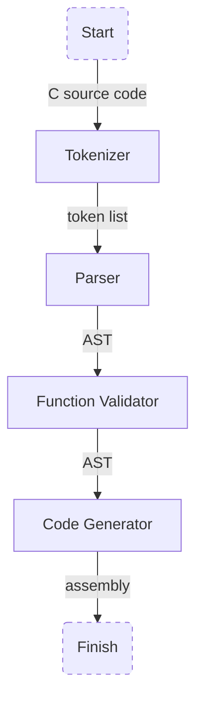

# 目次

# はじめに

2022年の夏、OCaml を勉強したあとに何か作りたくなって、C のサブセットのコンパイラを作りはじめました。CCaml というコンパイラです。

https://github.com/9sako6/ccaml

[Writing a C Compiler](https://norasandler.com/2017/11/29/Write-a-Compiler.html) という、Nora Sandler さんが書かれたコンパイラ実装の解説記事に沿って実装していきました。
この解説記事において、コンパイラ実装に使う言語の指定は特にありません。たまに出てくる疑似コードは Python で書かれています。

なるべく小さい機能をコンパイルするところから始めてインクリメンタルに開発しました[^1]。
最初にコンパイルできるようになったのは、数値を返すだけの `main` 関数でした。

[^1]: [Abdulaziz Ghuloum. An Incremental Approach to Compiler Construction. Proceedings of the 2006 Scheme and Functional Programming Workshop](http://scheme2006.cs.uchicago.edu/11-ghuloum.pdf) という論文で、コンパイラをインクリメンタルに作るアプローチが説明されている。

```c
int main() {
    return 42;
}
```

コンパイルして生成されたアセンブリです。

```text
  .globl main                        
main:
  mov $42, %rax
  ret
```

こんなところからスタートして、現在のところは各種算術演算子、ローカル変数、関数などが実装されています。
まだいろいろ機能が足りていないのですが、標準ライブラリの `putchar` を使って `Hello, World!` することができます。

```c
int putchar(int c);

int main() {
    putchar(72);
    putchar(101);
    putchar(108);
    putchar(108);
    putchar(111);
    putchar(44);
    putchar(32);
    putchar(87);
    putchar(111);
    putchar(114);
    putchar(108);
    putchar(100);
    putchar(33);
    putchar(10);

    return 0;
}
```

```bash
$ dune exec ccaml examples/valid/hello_world.c | gcc -xassembler - && ./a.out
Hello, World!
```


# プログラム実行の流れ

C 言語で書かれた文字列をトークン列に分解し、AST を組み立て、AST に対応するアセンブリを吐き出します。出力されたアセンブリを GCC で実行ファイルにして実行します。

Function Validator というのは、関数の宣言と定義にエラーがないかをチェックするモジュールです。



# 演算子

演算子には優先順位があるので、それを守る必要があります。
このためには、演算子ごとに別の生成規則を用意するといいっぽいです。

```text
<exp> ::= <mult-div-exp> { ("+" | "-") <mult-div-exp> }
<mult-div-exp> ::= <factor> { ("*" | "/") <factor> }
<factor> ::= "(" <exp> ")" | <unary_op> <factor> | <int>
<unary_op> ::= "!" | "-" | "~"
```

パーサーを作る上で、演算を左結合で行うために少し工夫が必要でした。
例えば `20 / 4 / 2` という割り算は `(20 / 4) / 2` の順で計算しないといけません。
普通に再帰下降構文解析をしていると、右結合になります。
左結合にするために、演算子トークンにぶつかると一旦再帰をやめて、同じ優先順位の演算子を見つけに行き、それまでに現れたトークン列で二項演算用の AST を作るようにしています。

# ローカル変数

スタックに値を積んで、`RBP` からのオフセットを指定して参照しています。

# 関数

高級言語では簡単に関数呼び出しを記述できますが、アセンブリではそうもいきません。
引数の準備、戻り値の返し方、スタックを使うのかレジスタを使うのか等を決める必要があります。
このような取り決めを呼び出し規約というようです。

リンカでリンクされるオブジェクトファイル間では同じ呼び出し規約に従う必要があります。
私は Ubuntu を開発環境に使っていたので、Linux で使われているらしい System V AMD64 ABI 呼出規約で実装しました。
引数をレジスタで受け渡す規約です。

とはいえ、CCaml では正しい実装になっていないと思います。
引数をレジスタで渡す場合、再帰呼び出ししたときに元のレジスタの値をどう保持すればいいかわからなかったので、引数をスタックとレジスタの両方に格納しています。

```c
int rec(int n) {
  // 第一引数は RDI レジスタで渡されるため、
  // RDI レジスタの値は n である
  rec(n - 1);　// 再帰呼び出しをすると...
  // RDI レジスタの値が n - 1 になってしまう
}
```

そこで、引数は cdecl 規約のようにスタックで渡し、スタックから参照するようにしました。
加えて、標準ライブラリとリンクするために、レジスタでも引数を渡すようにしています。
非効率なので GCC がどんなアセンブリを吐き出すか観察[^2]しつつ、直したいポイントです。

[^2]: `-fno-asynchronous-unwind-tables` オプションをつけるとアセンブリのノイズを取って出力できる。これなしだと、GCC がアセンブリに色々メタ情報的なのを書き込むので見づらい。

# コンパイラを作ることで得られたもの

- アセンブリの知識
- コンパイラって中身がわからなくて怖かったけど、結局はソースコードをゴニョゴニョしてアセンブリに変換してるだけか、という超克状態

- 簡単な言語だったらイチから実装できそう感
- Linter とか Formatter を自分で作れそう感

# OCaml が良い

ヴァリアントを使うと、パターンマッチング時の漏れを検知してくれるのが好きです。
あと、型の推論が効くので自分で明示的に型付けする必要がなかったです。

あえてつらみを挙げるとすれば、prity print の不在でしょうか。
例えば Ruby だと `pp` メソッドを使ってオブジェクトの構造を標準出力できますが、OCaml で同じことをする方法がわかっていません。
AST を文字列で表示するために、専用のインスペクタを作る必要がありました。
デバッガを覚えればもしかしたら解決するつらみかもしれません。

開発時は自前の Dockerfile を用意して devcontainer でコンテナ内に入って作業していました。
不便は特に感じませんでした。

ビルドツールには [dune](https://dune.build/) を使いましたが、習熟度が低いので活用できていません。
便利さは感じており、例えば当リポジトリの場合は `dune exec ccaml source.c` でアセンブリ出力、`dune test` でテスト実行ができます。
さらに、標準出力のテストが楽で驚きました。
例えば、実行すると標準出力に何かを出力する `compiler_e2e_test.ml` というテストがあったとき、`compiler_e2e_test.expected` というファイルに期待値を書いておくと期待値通りの出力がなされたかテストしてくれます。

テストフレームワークには [mirage/alcotest](https://github.com/mirage/alcotest) を使いました。
これも習熟度が低いので活用できていません。

# 今後

C 言語コンパイラ実装界隈ではセルフホストがひとつの達成地点になっているように見えます。
私は OCaml で実装しているので、ちょうどよい目標が定まっていません。

しばらくは、C 言語に近づける作業をやるつもりです。
CCaml は C 言語としての機能が全く足りていないです。
`int` 以外の型、ポインタ、配列、文字列リテラル、構造体、プリプロセッサを実装予定です。

https://github.com/9sako6/ccaml

# 参考文献・ツール

1. [Writing a C Compiler, Part 1](https://norasandler.com/2017/11/29/Write-a-Compiler.html)
1. [Writing a C Compiler, Part 2](https://norasandler.com/2017/12/05/Write-a-Compiler-2.html)
1. [Writing a C Compiler, Part 3](https://norasandler.com/2017/12/15/Write-a-Compiler-3.html)
1. [Writing a C Compiler, Part 4](https://norasandler.com/2017/12/28/Write-a-Compiler-4.html)
1. [Writing a C Compiler, Part 5](https://norasandler.com/2018/01/08/Write-a-Compiler-5.html)
1. [Writing a C Compiler, Part 6](https://norasandler.com/2018/02/25/Write-a-Compiler-6.html)
1. [Writing a C Compiler, Part 7](https://norasandler.com/2018/03/14/Write-a-Compiler-7.html)
1. [C Compiler, Part 8: Loops](https://norasandler.com/2018/04/10/Write-a-Compiler-8.html)
1. [C Compiler, Part 9: Functions](https://norasandler.com/2018/06/27/Write-a-Compiler-9.html)
1. [nlsandler/nqcc: A compiler for a tiny (but growing!) subset of C, written in OCaml.](https://github.com/nlsandler/nqcc)
1. [低レイヤを知りたい人のための C コンパイラ作成入門](https://www.sigbus.info/compilerbook)
1. [x86 アセンブリ言語での関数コール](https://vanya.jp.net/os/x86call/)
1. [AT&T assembly syntax and IA-32 instructions](https://gist.github.com/mishurov/6bcf04df329973c15044)
1. [Online GCC Assembler - online editor](https://www.onlinegdb.com/online_gcc_assembler)
1. [Wandbox](https://wandbox.org/)
