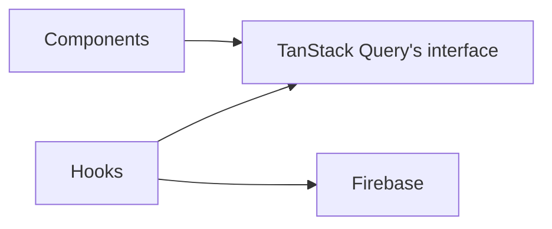

Firebase に密結合しすぎず、将来的に Firebase から離れるのを簡単にしたい。
状況によって、Firestore から別のデータソース （RDB や GraphQL など）に乗り換える可能性はある。

かつ、TanStack Query (React Query) を使いたい。
TanStack Query や SWR はクライアントサイドでデータフェッチするための強力な Hooks であり、Firebase を採用するだけで使えなくなるのはけしからん。

そんな動機で、フロントエンドのコンポーネントから Firebase が隠蔽された状態で TanStack Query を使えるようにする実装と設計をします。

# 目次

# 結論

話はシンプルです。Firebase をラップしつつ TanStack Query のインターフェイスをもつラッパー関数を作ろう。

# 既存実装

この手のラッパー関数は OSS として既に存在し、有名どころは [CSFrequency/react-firebase-hooks](https://github.com/CSFrequency/react-firebase-hooks) や [invertase/react-query-firebase](https://github.com/invertase/react-query-firebase) です。

ただし、両方の採用を見送って自前で実装することにしました。

CSFrequency/react-firebase-hooks は、TanStack Query に似たインターフェイスを持っていますが同じではありません。つまり、コンポーネントは react-firebase-hooks に依存することになり、実質的に Firebase に依存を持つことになります。

invertase/react-query-firebase は、実際に私も直面しましたが [Firestore のリアルタイムアップデートが動かない問題](https://github.com/invertase/react-query-firebase/issues/25)があって採用を見送りました。あとはまだ TanStack Query に対応していなかったり、それほどメンテされていないことも理由の一つ。

とはいえ、自前実装にあたって両者の実装やテストを参考にしたので感謝の意を表明しておきます。


# 実装

目標は、

- Firebase を剥がすときにコンポーネントのコードに変更が入らない
- コンポーネントからは TanStack Query のインターフェイスが実装された Hooks を呼び出す

ということです。依存関係を図示すると以下のようになるでしょうか。



例として、記事 `Post` の一覧をフェッチしてレンダリングする場合を考えてみます。

コンポーネントからは TanStack Query のインターフェイスをもつ `useNewPostsQuery` を呼び出してデータフェッチします。

```tsx
import { useNewPostsQuery } from '@hooks/posts/useNewPostsQuery';

export const RecentPostList = () => {
  const { data: posts, isLoading, isError } = useNewPostsQuery()

  if (isLoading) return <div>Loading ...</div>;
  if (isError) return <div>Error</div>;

  return (
    <section>
      {posts.map((post) => (
        <PostListItem key={post.id} post={post} />
      ))}
    </section>)
}
```

コンポーネントが呼び出す `useNewPostsQuery` Hooks は TanStack Query のインターフェイスをもつので `() => UseQueryResult<Post[]>` 型の関数になります。
`UseQueryResult<T>` というのは TanStack Query の `useQuery` の戻り値の型です。

実装は以下のようになります。
ここで、後述する Firebase のラッパー関数 `useFirestoreCollection` を使っています。

```typescript
import { UseQueryResult } from '@tanstack/react-query';
import { collection, getFirestore, limit, orderBy, query, where } from 'firebase/firestore';
import { useFirestoreCollection } from '@lib/hooks/useFirebaseCollection';
import { Post } from '@models/post';

export function useNewPostsQuery(): UseQueryResult<Post[]> {
  const db = getFirestore();
  const q = query(
    collection(db, 'posts'),
    where('public', '==', true),
    limit(MAX_POSTS_NUM),
    orderBy('createdAt', 'desc'),
  );

  return useFirestoreCollection<Post[]>('new-posts', q, (snapshot) =>
    snapshot.docs.map((doc) =>
      Post.parse({
        ...doc.data(),
        id: doc.id,
        createdAt: doc.data().createdAt.toDate().toISOString(),
        updatedAt: doc.data().updatedAt.toDate().toISOString(),
      }),
    )
  );
}
```

Firebase のラッパー関数 `useFirestoreCollection` は Firestore のクエリを入力として `UseQueryResult<T>` を返すように実装されています。

`return` の部分を見るとわかりますが、Firebase のラッパー関数 `useFirestoreCollection` は Firestore のクエリ `q` を第二引数で受け取っています。


```typescript
return useFirestoreCollection<Post[]>('new-posts', q, (snapshot) => { ... });
```

第一引数で渡している `new-posts` は TanStack Query で行うキャッシュ用のキーです。
第三引数は Firestore から取得したドキュメント達を、Zod で定義された `Post` 型に変換するためのコールバック関数です。

さて、本題のラッパー関数 `useFirestoreCollection` の実装は以下です。
オプションでリアルタイムアップデートを有効にできます。
さらに、前述の通り Firestore から取得したドキュメントを変換するためのコールバック関数を渡せるようになっています。

```typescript
import { QueryKey, useQuery, useQueryClient, UseQueryResult } from '@tanstack/react-query';
import {
  DocumentData,
  FirestoreError,
  getDocs,
  onSnapshot,
  Query,
  QuerySnapshot,
  Unsubscribe,
} from 'firebase/firestore';
import { useEffect } from 'react';

type Options = {
  subscribe: boolean;
};

const defaultOptions: Options = {
  subscribe: true,
};

const useQueryOptionsForOnSnapshot = {
  staleTime: Infinity,
  refetchInterval: undefined,
  refetchOnMount: true,
  refetchOnWindowFocus: false,
  refetchOnReconnect: false,
};

export function useFirestoreCollection<Result>(
  queryKey: QueryKey,
  query: Query<DocumentData>,
  select: (data: QuerySnapshot<DocumentData>) => Result,
  options: Options = defaultOptions,
): UseQueryResult<Result, FirestoreError> {
  const queryClient = useQueryClient();
  const useQueryOptions = options.subscribe ? useQueryOptionsForOnSnapshot : {};
  let unsubscribe: Unsubscribe = () => {};

  const queryFn = () => {
    if (!options.subscribe) {
      return getDocs(query);
    }

    let isResolved = false;

    return new Promise<QuerySnapshot<DocumentData>>((resolve, reject) => {
      try {
        unsubscribe = onSnapshot(query, (snapshot) => {
          queryClient.setQueryData(queryKey, snapshot);

          if (!isResolved) {
            isResolved = true;
            resolve(snapshot);
          }
        });
      } catch (error) {
        reject(error);
      }
    });
  };

  useEffect(() => {
    if (options.subscribe) {
      window.addEventListener('beforeunload', () => {
        unsubscribe();
      });
    }

    return unsubscribe;
  }, [options.subscribe]);

  return useQuery({
    queryKey,
    queryFn,
    select,
    ...useQueryOptions,
  });
}

```

上記はコレクションを取得する用のラッパー関数です。ドキュメント単体を取得するには以下を使います。

```typescript
import { QueryKey, useQuery, useQueryClient, UseQueryResult } from '@tanstack/react-query';
import {
  DocumentData,
  DocumentReference,
  FirestoreError,
  getDoc,
  onSnapshot,
  DocumentSnapshot,
  Unsubscribe,
} from 'firebase/firestore';
import { useEffect } from 'react';

type Options = {
  subscribe: boolean;
};

const defaultOptions: Options = {
  subscribe: true,
};

const useQueryOptionsForOnSnapshot = {
  staleTime: Infinity,
  refetchInterval: undefined,
  refetchOnMount: true,
  refetchOnWindowFocus: false,
  refetchOnReconnect: false,
};

export function useFirestoreDoc<Result>(
  queryKey: QueryKey,
  docRef: DocumentReference<DocumentData>,
  select: (data: DocumentSnapshot<DocumentData>) => Result,
  options: Options = defaultOptions,
): UseQueryResult<Result, FirestoreError> {
  const queryClient = useQueryClient();
  const useQueryOptions = options.subscribe ? useQueryOptionsForOnSnapshot : {};
  let unsubscribe: Unsubscribe = () => {};

  const queryFn = () => {
    if (!options.subscribe) {
      return getDoc(docRef);
    }

    let isResolved = false;

    return new Promise<DocumentSnapshot<DocumentData>>((resolve, reject) => {
      try {
        unsubscribe = onSnapshot(docRef, (snapshot) => {
          queryClient.setQueryData(queryKey, snapshot);

          if (!isResolved) {
            isResolved = true;
            resolve(snapshot);
          }
        });
      } catch (error) {
        reject(error);
      }
    });
  };

  useEffect(() => {
    if (options.subscribe) {
      window.addEventListener('beforeunload', () => {
        unsubscribe();
      });
    }

    return unsubscribe;
  }, [options.subscribe]);

  return useQuery({
    queryKey,
    queryFn,
    select,
    ...useQueryOptions,
  });
}

```

# テスト

ラッパー関数は Hooks なので、[Testing Library](https://testing-library.com/docs/react-testing-library/api#renderhook) の `renderHook` を使ってテストできます。Firebase のセットアップ等は省略しますが以下のような感じです。

```typescript
it('should return a subscribed document data', async () => {
  // Create a public post.
  const postTitle = 'post-title';
  await db
    .collection('posts')
    .doc('public-post-id')
    .set({ ...publicPostTemplate, title: postTitle });

  const { result, waitFor } = renderHook(
    () =>
      useFirestoreDoc<Post>(
        ['useFirebaseDoc', 'test', 'post'],
        doc(getFirestore(), 'posts', 'public-post-id'),
        (doc) => {
          return Post.parse({
            ...doc.data(),
            id: doc.id,
            createdAt: doc.data()?.createdAt.toDate().toISOString(),
            updatedAt: doc.data()?.updatedAt.toDate().toISOString(),
          });
        },
        { subscribe: true }
      ),
    {
      wrapper,
    },
  );
  await waitFor(() => result.current.isSuccess, { timeout: 5000 });

  if (!result.current.data) throw new Error('Failed to fetch the post.');

  expect(result.current.data.id).toEqual('public-post-id');
  expect(result.current.data.title).toEqual('post-title');

  // Edit the post's title.
  await db
    .collection('posts')
    .doc('public-post-id')
    .set({ ...publicPostTemplate, title: 'new-post-title' });

  // Wait 1000 ms to stabilize.
  await sleep(1000);

  // The post's title should be updated.
  expect(result.current.data.title).toEqual('new-post-title');
});
```

# Firebase を剥がすときどうなるか

仮に Firestore ではなく API から `Post` 一覧を取得することになっても、コンポーネントの実装は変更する必要がない。

```tsx
import { useNewPostsQuery } from '@hooks/posts/useNewPostsQuery';

export const RecentPostList = () => {
  const { data: posts, isLoading, isError } = useNewPostsQuery()

  if (isLoading) return <div>Loading ...</div>;
  if (isError) return <div>Error</div>;

  return (
    <section>
      {posts.map((post) => (
        <PostListItem key={post.id} post={post} />
      ))}
    </section>)
}
```

コンポーネントが呼び出す Hooks `useNewPostsQuery` を以下のように変更すればよい。

```typescript
import { UseQueryResult, useQuery } from '@tanstack/react-query';
import { Post } from '@models/post';

const fetchPosts = async () => {
  const response = await fetch(`/v1/posts`);
  return Post.parse(await response.json());
};

export function useNewPostsQuery(): UseQueryResult<Post[]> {
  return useQuery({
    queryKey: ['new-posts'],
    queryFn: fetchPosts,
  });
}
```

# 懸念

## Firestore のリアルタイムアップデートを使っていた場合、移行できる保証はない

Firebase を使うと、`onSnapshot` でお気軽に WebSocket によるリアルタイムアップデートを堪能できます。
しかしながら、Firebase を剥がした先でこれを実現できるとは限りません。

## TanStack Query に依存してる

React 18 では、Suspense を使ってローディング時のレンダリングができます。React Query に代表されたような `const {data, isLoading} = useQuery(...)` ではないわけです。
Next.js 13 の App Directory では loading.ts によってローディング時のレンダリングを制御できます。

TanStack Query も時代の変化についていくでしょうが、これまで通りの地位を保ち続けるかはわかりません。

## Firebase を使うことで CSR にせざるを得ない時点で強い依存

Firebase は BaaS というもので、Firebase がバックエンドの代わりになるので SDK を使えばクライアントサイドでアプリケーションを組むことができます。
逆に言えば、Firebase を使うと基本的に CSR を強いられることになります。

Next.js 13 で導入された App Directory はデフォルトが Server Component の世界です。
Next.js が Server Component をメインに据えているのに CSR を強いられるのは覚悟がいることに思います。

# おわり

Firebase はいいものです。Firestore なら RDB を使うより圧倒的に安く済みます。リアルタイムアップデートも簡単です。

しかし、先に述べたような懸念や、ベンダーロックインしやすい面があります。
本記事で述べたようにしてなるべくコンポーネントから Firebase を隠蔽することにより、いつか来るかもしれない別れの痛みを抑えることができるかもしれません。
