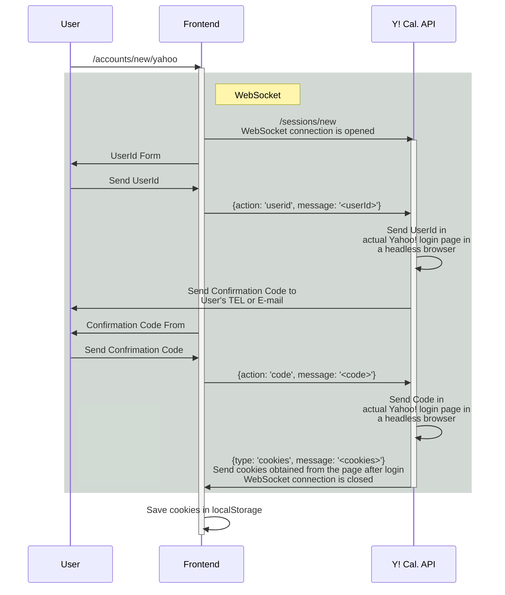
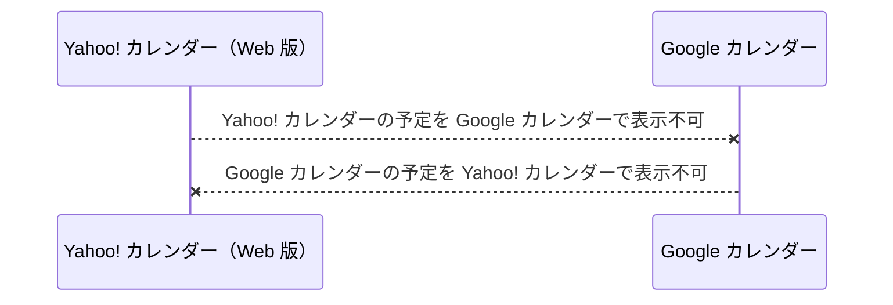
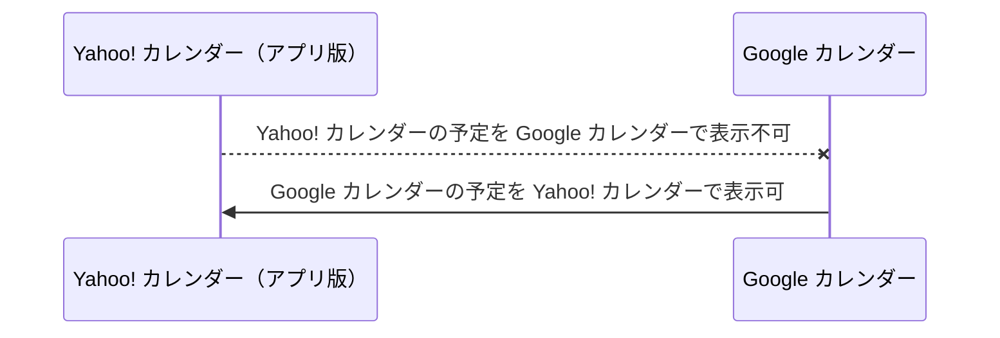
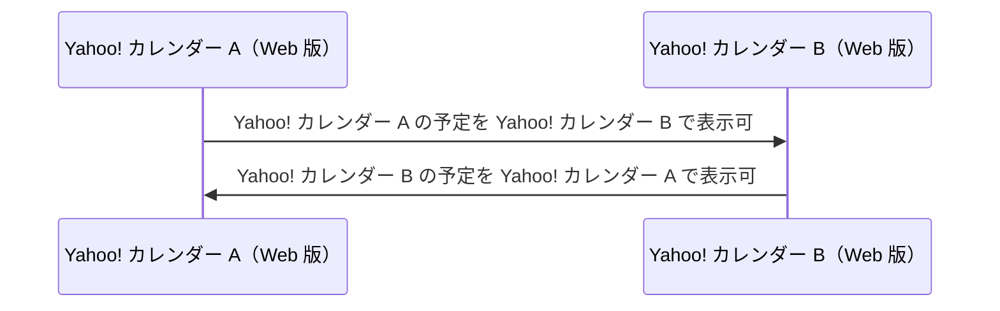
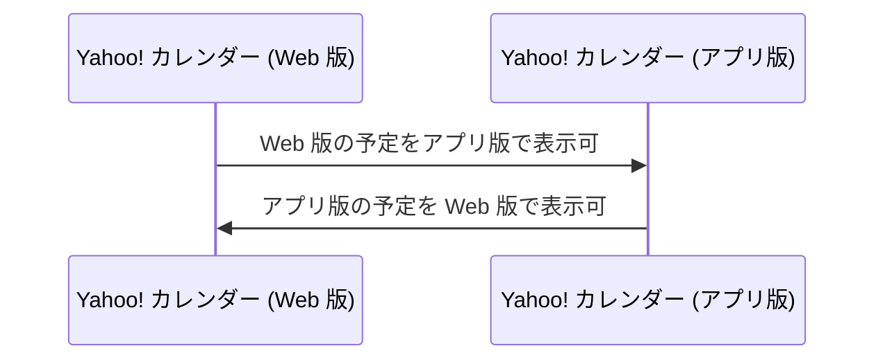
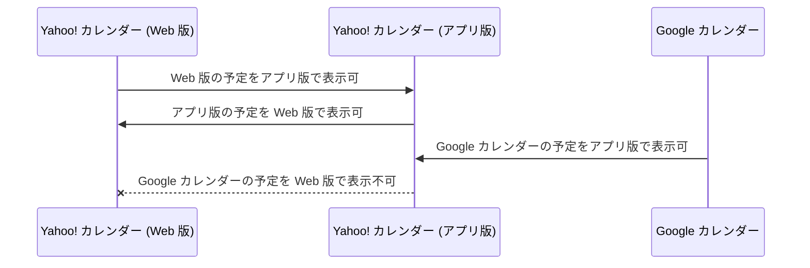
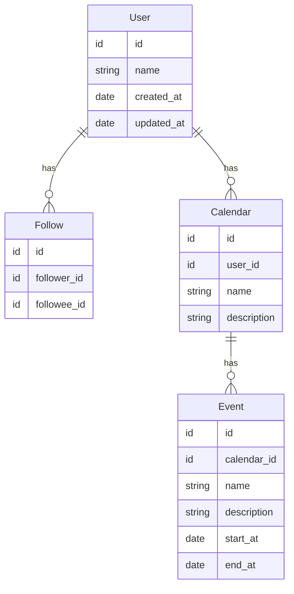
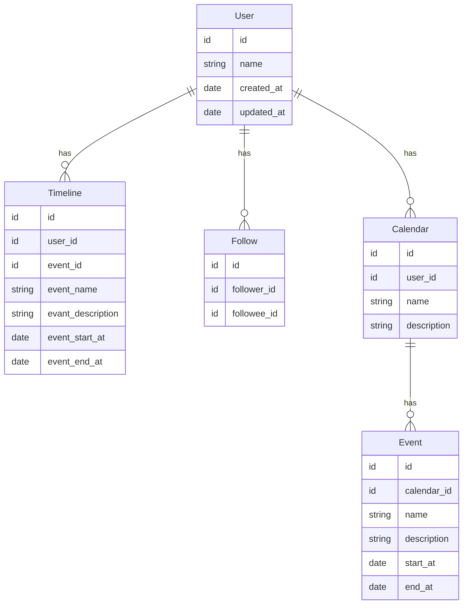

# 概要

最近私は、カレンダーを使った SNS を構想している。 不特定多数に予定を公開することができるし、誰かの公開された予定を見ることもできるという代物である。

予定というものは、センシティブな個人情報である。したがって、不特定多数に予定を公開するのは憚られることだろう。しかし、私は他人が日々をどう過ごしているかを知りたくなることがある。YouTube
で有名人がルーティーン動画をアップロードしているのも需要があるからだろう。カレンダー SNS
を通じて、人々が自分の予定を公開することを厭わないムードを作りたい。

個人ではなく芸能人やお店、法人であれば、イベントの告知やお店の休業情報等を発信するのに気兼ねなくカレンダー SNS を使える。

不特定多数に公開しなくても、大いに使い道はある。自分の身内や閉じたコミュニティ内に向けて予定を共有したいときに使える。
例えば、カップルがお互いの予定を把握するために使うことができる。

# 要件

## 外部カレンダーの連携 (MUST)

SNS 上で表示するカレンダーは、外部のサービスから取り込むことを想定する。Google カレンダーや Yahoo! カレンダーなどである。

SNS 利用者は、SNS 上で予定を追加・編集できるし、普段から使い慣れているカレンダーをそのまま利用することもできる。

法人も同じである。カレンダー SNS に既存のカレンダーを連携すれば、あとはほったらかしでもカレンダー SNS の利用者にイベントを告知することができる。

## 公開レベル (MUST)

カレンダーには、3つの公開レベルのうちいずれかを設定できる。

- 公開
  - カレンダーを全てのユーザーに公開する
  - イベントの告知やお店の営業・休業のお知らせなどに使う
- 限定公開
  - カレンダーを特定のユーザーにのみ公開する
  - 身内や閉じたコミュニティ内で共有したいときに使う
- 非公開
  - カレンダーを自分しか見られなくする

## カレンダー閲覧 (MUST)

自分のカレンダーを見る機能である。
他の人の限定公開カレンダーを閲覧する権限がある場合、そのカレンダーも重ねて表示する機能をつける予定である。

## タイムライン (RECOMMENDED)

他の人の予定を見るために、タイムラインを用意したい。 開始時刻順にソートされたイベントたちが、ずらりと表示されるタイムラインを作りたい。

タイムラインに表示される予定は、公開カレンダーのものである。

どのユーザーの予定をタイムラインに表示するかを決めるために、フォロー（という命名でいいのかは検討中の）機能をつける予定である。

# サービスの特性

世の中には iCalendar [^1] というカレンダーの記述形式があり、これを使って異なるサービス間で予定を共有することができる。例えば、Outlook
の予定表を、Google カレンダーでも見られるようにするといったことが可能である。

すでにカレンダーを共有する方法はある程度確立されているという前提の上で、本サービスの存在意義を問うてみる。

[^1]: [RFC 5545 - Internet Calendaring and Scheduling Core Object Specification (iCalendar)](https://datatracker.ietf.org/doc/html/rfc5545)

## Yahoo! カレンダーと連携できる点

結論から言うと、Yahoo! カレンダーは外部のカレンダーに連携できないという問題がある。API もないので連携するのが困難である。本サービスでは、工夫によって
Yahoo! カレンダーとも連携できるようにする。 私は Yahoo! カレンダーと連携するために
[9sako6/yahoo-calendar-api](https://github.com/9sako6/yahoo-calendar-api)
という、独自の API を開発している。API の内部ではヘッドレスブラウザや WebSocket を使って涙ぐましい SMS
認証突破とスクレイピングを行っている。



以下は Yahoo! カレンダーの仕様調査の結果なので読み飛ばして構わない。

Yahoo! カレンダーには Web 版とスマホアプリ版が存在する。アプリ版を使えば、Yahoo!
カレンダー上で外部のカレンダーを表示する方法はある。しかし、逆に Yahoo! カレンダーを外部のカレンダーで表示する方法は見つけられていない。

Yahoo! カレンダーは iCalendar 形式の .ics
ファイルでカレンダーをエクスポートできるが、あくまでその時点でのカレンダーをエクスポートするのみなので、外部のカレンダーにインポートしても Yahoo!
カレンダーと同期することはできない。





なお、Yahoo! カレンダーどうしであれば連携して予定を共有することができる。連携設定は Web 版からのみ可能で、連携された予定はアプリ版でも表示はできる。



加えて、Web 版とアプリ版を同期することもできる。



一見すると、Web 版とアプリ版が連携できるなら、アプリ版で連携した外部のカレンダーを Web 版でも表示できそうである。

しかしながら、外部のカレンダーを表示できるのはアプリ版のみである。アプリ版の Yahoo!
カレンダーは、スマホに登録された認証情報をつかって外部のカレンダーの情報を取得している。Web
版ではその認証情報を使えないので、外部のカレンダーの情報を得ることはできないのである。



## SNS を形成する点

カレンダーサービスどうしを連携できるといっても、カレンダーが十分に共有されているとは言い難い。

例えば、Google カレンダーを公開しているお店を私は見たことがない。公開してくれれば、急な休業を知らないまま現地に着いてしまう悲劇を起こさなくて済むのに。

SNS を形成することにより、カレンダーを公開する側も公開される側も得をするネットワークを形成できる。
タイムライン機能はイベントの広告になるし、ユーザーは悲劇を体験しなくて済む。

# 技術的課題

## DB 設計

<!-- iCalendar の RFC を見ればわかるが、スケジュール情報を作るためには複数のオブジェクトが必要である。 -->

RDBMS
でタイムライン機能を見据えた設計をしようとすると、設計が難しい。下記のナイーブな設計でタイムラインを表示しようとすると、フォロイーをとってきて、各カレンダーにはイベント等を
`JOIN` し、ソートする必要がある。



```sql
SELECT * FROM events
INNER JOIN calendars ON events.calendar_id = calendars.id
WHERE calendars.user_id IN (
  SELECT followee_id FROM followers
  WHERE follower_id = 1234 -- 自分の ID
)
ORDER BY events.start_at
LIMIT 50
OFFSET 0;
```

これは Read Heavy/ Wright Light である。フォロイーが増えるにつれてイベントを取得するのに時間がかかるようになる。

Read Light / Wright Heavy にしたい。 Read Light にするためには、タイムライン用の1つのテーブルから読み取るようする。



```sql
SELECT * FROM timelines
WHERE user_id = 1234 -- 自分の ID
ORDER BY event_start_at
LIMIT 50
OFFSET 0;
```

これを実現するためには、あるユーザーがイベントを追加したとき、フォロワー全員の `timelines` テーブルにレコードを追加する必要がある。
加えて、イベントの更新・削除とタイムラインを同期する必要がある。

どう実装すべきかまだ答えは出ていないが、iCalendar の RFC を見ながらテーブル数を減らした設計ができないか考えたり、RDBMS
を使わない道を考えたりしている。 下記の実装が参考になりそうな気がしている。

- [CyberZ が Amazon DynamoDB を使用してフォロータイムラインの表示に必要な Read-Light 方式を実現した方法 | Amazon Web Services ブログ](https://aws.amazon.com/jp/blogs/news/how-cyberz-performs-read-light-operations-to-display-followees-activities-in-the-timeline-using-amazon-dynamodb/)
- [1000万ユーザに耐えるサーバを作ってみた](https://zenn.dev/higashimura/articles/74c6e6bf63a133)
