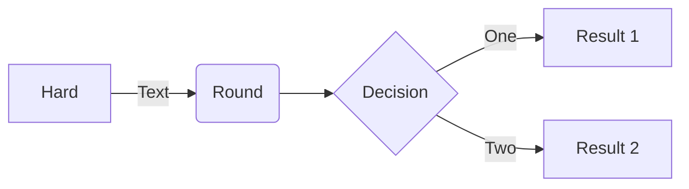
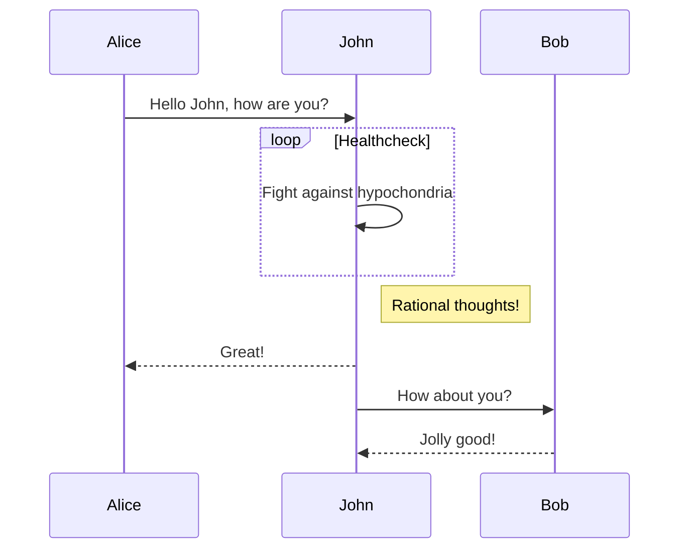
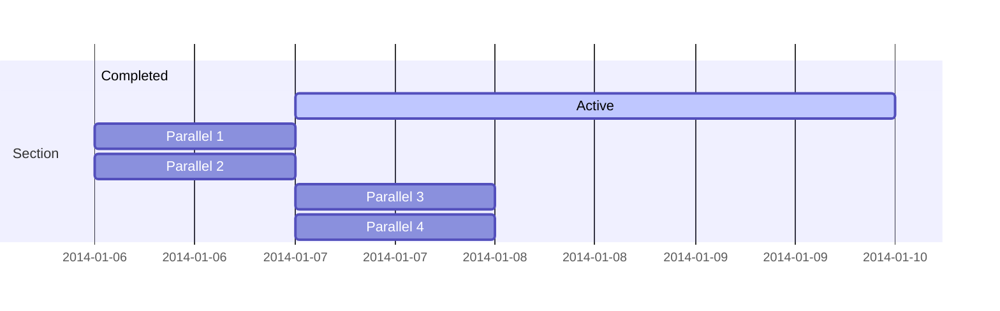
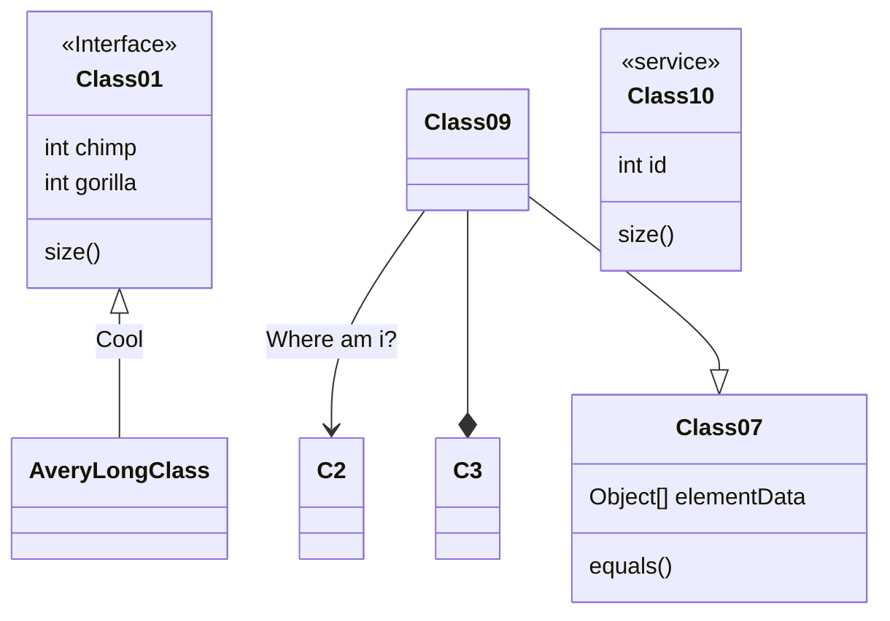
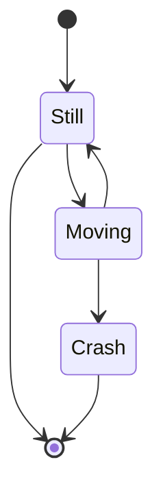
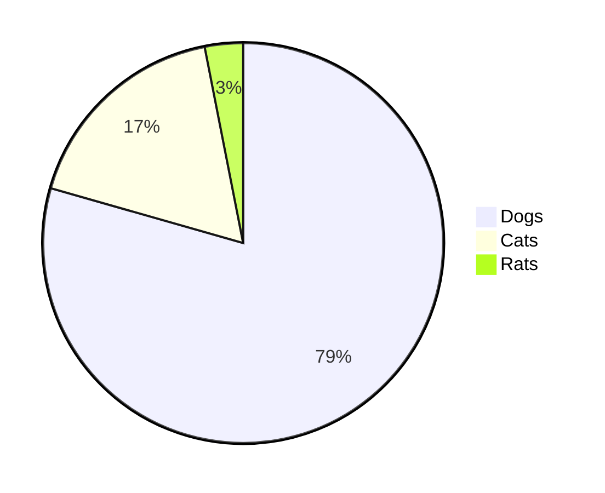
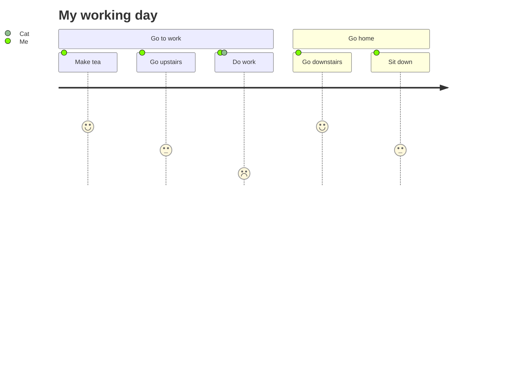

[Mermaid](https://mermaid-js.github.io/mermaid/#/) is now available on this blog.
I will describe how to make it available as soon as possible.

The following diagrams are examples from [mermaid-js/mermaid](https://github.com/mermaid-js/mermaid).

